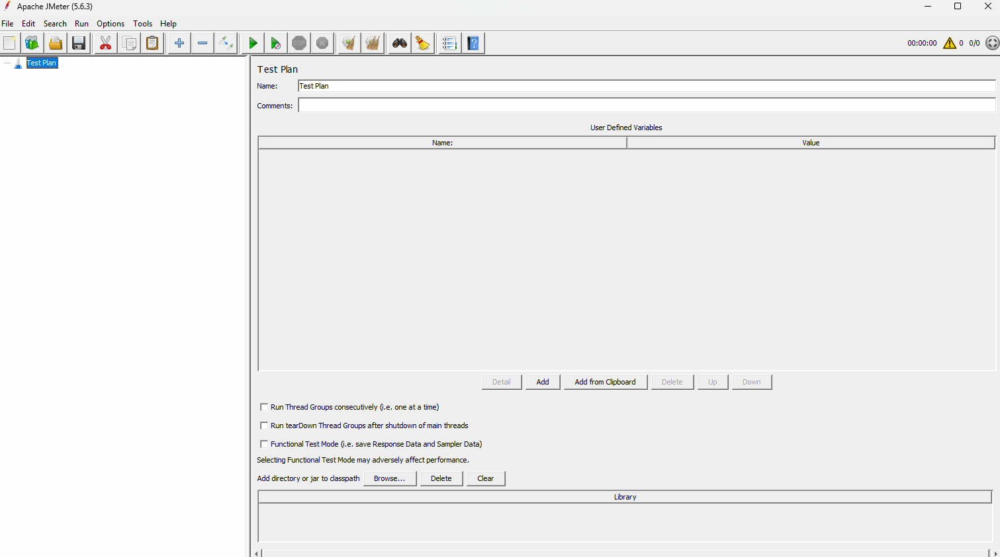
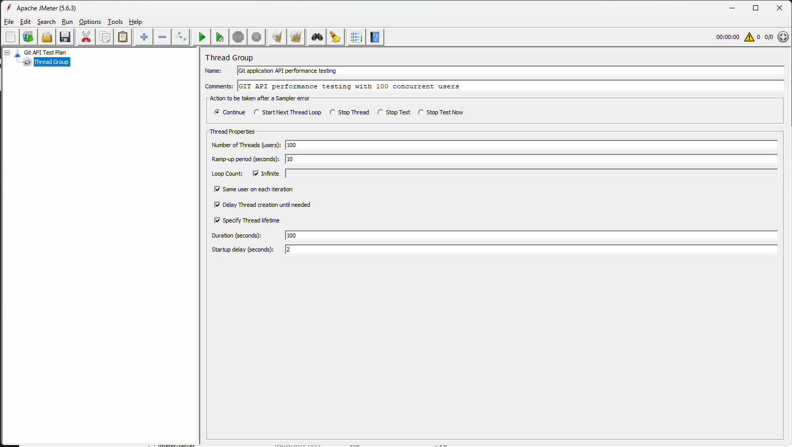

## API Performance Testing 

## What is performance testing? 
Performance testing is all about validating our application in such a way that what will happen when multiple users are going to use our application at the same time. 

In short, performance testing is all about how fast an application is responding to each and every instruction provided by the user. 
How stable my application is when multiple users are using my application continuously? 
Whether my application is scalable? That means, can we increase the additional users in the future whenever it's needed? 

## Different types of performance testing ?

1. Load Testing => Load testing is all about testing the system under expected user load by gradually increasing the load. 

For example, the capacity of our application is 100 users. We are going to start from 10 users, and gradually we are going to increase the user count up to 100 and verify application behavior. The main goal is just to verify the response time and stability of our application when we are increasing the load up to the max limit. 

2. Stress testing => Trying to push our system beyond the limits 

For example, the capacity of our application is 100 users. Now we are going to add 10 to 20% more users to our application and verify our application behavior with additional load. The main goal of stress testing is identifying the breaking point. 

3. Spike testing => Spike testing is all about a sudden increase or decrease in the load within a specific interval. 

Best example for this Spike testing is a flash sale happening on Amazon. 

4.  Soak Testing / endurance testing => Endurance testing or Soak testing is all about running the system for a long duration continuously. 
Main goal is understanding the memory leakages and degradation of application performance when we are going to maintain the same load for so long. 

## Why is performance testing so important? 
Performance testing is very important because if your application functionality is working well but your application is very slow, then most of your users are going to leave your application. 

## What are all the different tools available in the market to do the performance testing? 
1. Apache JMETER
2. Loadrunner 
3. Blazemeter
4. K6 

## What is JMeter ?
JMETER is an open source performance testing tool, and this tool will be used mainly to validate the performance testing related to UI and API.

Basically, 
JMETER will verify our application performance by simulating multiple users,
By sending multiple requests like HTTP request, DB request, and UI request to your application, and validating the performance.
And also JMETER is going to provide you multiple performance metrics. 

## Use the JMETER tool to perform API performance testing (step by step)

- Prerequisite : 
( We need to install JDK before running JMETER ) (https://download.oracle.com/java/26/latest/jdk-26_windows-x64_bin.exe )

1. Download the JMeter zip file from the JMeter official website. (https://dlcdn.apache.org//jmeter/binaries/apache-jmeter-5.6.3.zip)
2. Extract the files from the JMETER zip file. 
3. To the subfolder bin and inside the bin folder, double-click on the Apache JMETER JAR file. (ApacheJmeter.jar)
4. Wait until the test plan template is getting displayed to begin the performance testing within the JMETER tool. 

## This is a test plan in the JMETER ?
TestPlan is a root container that defines what to test, how to test, and with how many users you want to validate your application. 

Within the test plan, we can add 
- Thread group (Amount of users we want to deploy on our application to perform load testing )
- Samplers (The request: we want to validate by using JMETER. )
- Listeners (Listener is a component that is going to help us in capturing the test results. )
- Configuration elements (Environment variables and respective values, etc. )

Sample TestPlan

## What is Thread Group? 
Thread group is a template where we are going to add a group of virtual users that you want to deploy and ramp-up period Meaning, how much time we want to use to deploy all the users and the total number of iterations to be done. 

1. Name : Name of your project or purpose of performance testing 
For example:
- log in web service load testing
- application API performance testing

2. Comments : Short description of your project and the scenarios that you are validating 
For example, git API performance testing with 100 concurrent users 

3. Action to be taken after a sampler error : What should happen when your request is failing in the middle of the execution? 
continue(default) : Ignore the error and continue the execution. 
Start next thread loop : Stop current iteration and start the next loop. 
Stop Thread : Stop the entire thread for the current user. 
Stop Test : Stop the entire test. 

4. Thread properties (Most important part of the thread group )

=> Number of threads or users  : Totally, how many virtual users do you want to deploy? 
Ex: 100 users

=> Ramp up period in seconds => Total time we want to set to deploy all the users 
Ex: 10 Sec
That means 100 users will be deployed in 10 seconds. That means 10 users per second. It is going to deploy up to 100. 

=> Loop count : Total number of iterations to be executed to repeat the same process 
Ex: 2 Loops (I want to repeat the same process two times. )

5. Same user on each iteration : The same session or user will be reused with the same configuration to run all the API requests. 

6. Delay thread creation until needed : During the execution process, don't create virtual users until we need to trigger and execute the test. 

7. Specify thread lifetime :

=> Duration : Duration is all about the total time you want to test this application or you want to run this JMETER execution. 

=> Startup Delay : Delay before each and every test begins. For example, if I want to add two seconds, after two seconds only it is going to deploy the user and test the API request. 

## Configuration elements available in the JMETER 
Configuration elements are all about a set of templates, which we are going to use to maintain the test data or configuration data while sending the API request. 

Right-click on the thread group => Add => Config element => Select the component. 

Ex: User-defined variable, HTTP header manager, etc. 

User-defined variable : Default template to maintain the test data when we are sending multiple API requests where we are using common data 

## Samplers in JMeter ?
Samplers are all about the request that we want to validate with JMETER to understand the performance of our application. 

HTTP request sampler will be used for API performance testing. 

## How to add HTTP Request Sampler ?
Right-click on the thread group. => Add => Sampler => HTTP request 

## Assertions in JMETER ?
Assertions are all about a set of JMETER methods helping us to validate the API response with respect to the expected result. 

Assertions are very helpful to ensure the correctness of each and every API request. It can catch failure. It is also going to validate the response data. 

## Listeners in JMETER ?
Listeners are nothing but a set of components in JMeter that can record the test results related to performance metrics. 

View results tree => This listener is going to help us to capture each and every request and response to detail. 
Summary Report => This listener is going to capture the response time for each and every API request, and also it is going to provide you with the average response time, minimum, and maximum time for each and every individual thread. 
Assertion Results => Assertion results are all about validating each and every assertion added within the HTTP request. 

